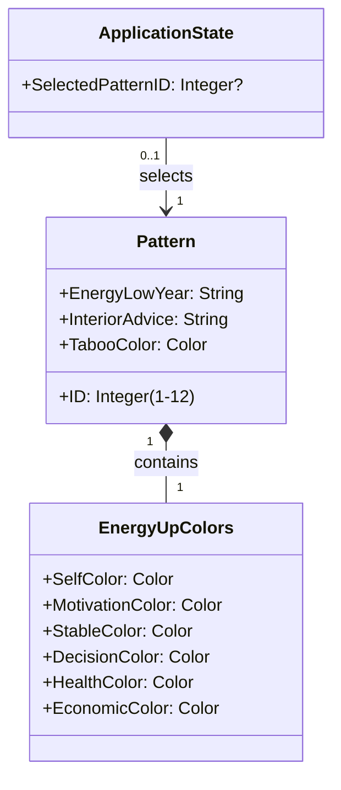
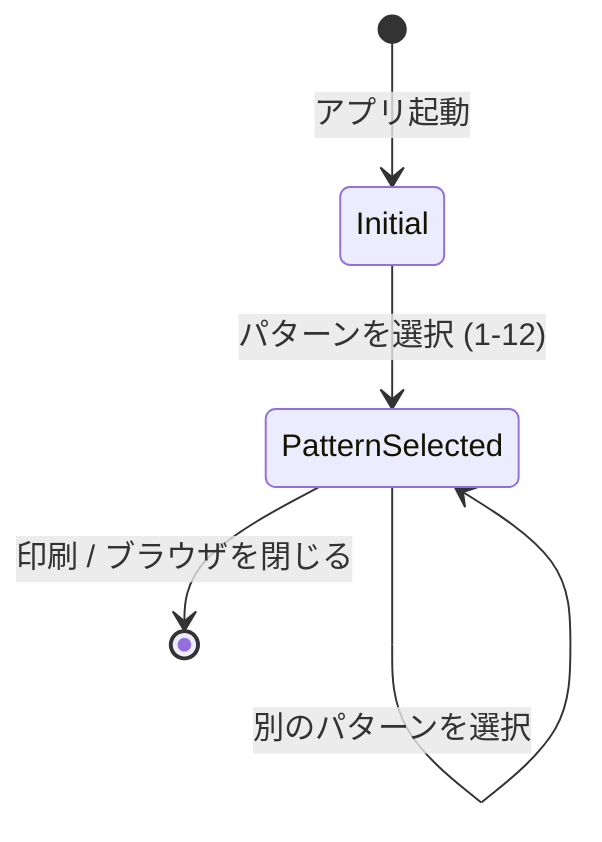
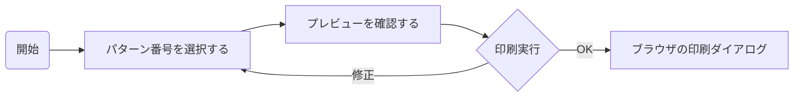

# フェーズ2: モデリング - 構造と振る舞いの定義

## 1. 概念データモデリング (構造の定義)

システムが管理・表示する情報の構造を定義します。
本システムにおける主要なデータは、事前に定義された「パターン」という静的な参照データです。

### クラス図 (概念モデル)

### オブジェクト詳細

#### Pattern (パターン)
12種類の定数データとしてシステムに保持される。
* **ID**: ユーザーが選択するキー (1〜12)。
* **EnergyLowYear**: エネルギーが落ちる年の表記（例：「子、丑、-」）。
* **InteriorAdvice**: 「能力を引き出すインテリア」に関するアドバイス文。
* **TabooColor**: タブー色（薬色）の色名。
* **EnergyUpColors**: 6種類のエネルギーUP色のセット。

#### EnergyUpColors (エネルギーUP色セット)
Patternに紐づく6色の組み合わせ。
* 各属性（自分色、やる気色など）は具体的な色名（例：「ピンク」「ブラウン」）を持つ。
* 色名だけでなく、表示用のカラーコード（HEX/RGB）も表示には必要となる（UIデザインフェーズで具体化）。

## 2. タスク/状態モデリング (振る舞いの定義)

### ステートマシン (状態遷移)

アプリケーションの状態は非常にシンプルで、「パターン未選択」か「パターン選択済み」かの2状態が主となります。

* **Initial (初期状態)**: パターンが選択されていない状態。プレビューエリアは空、またはダミーが表示されている。
* **PatternSelected (選択済み状態)**: 特定のパターンが選択され、プレビューエリアに該当パターンのデータ（色、テキスト）が反映されている状態。

### タスクフロー

ユーザーが目的を達成するための手順を定義します。

1. **パターン選択**: ユーザーはUI上の選択肢（ボタンやプルダウンなど）から、事前に特定した番号(1-12)を選択する。
2. **プレビュー確認**: ユーザーは画面上のプレビューを見て、意図したパターンの内容（特にアドバイス文や色の構成）が表示されているか確認する。
3. **印刷**: 確認後、印刷ボタンを押下し、ブラウザの標準印刷機能・PDF保存機能を呼び出す。
