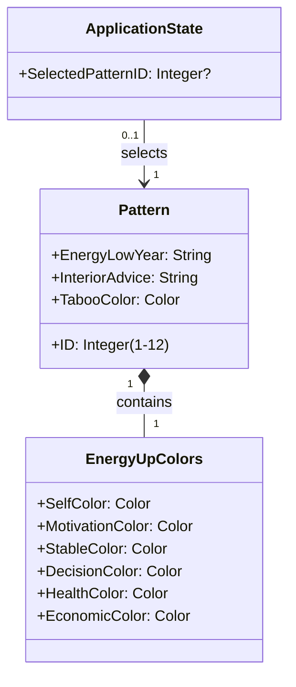
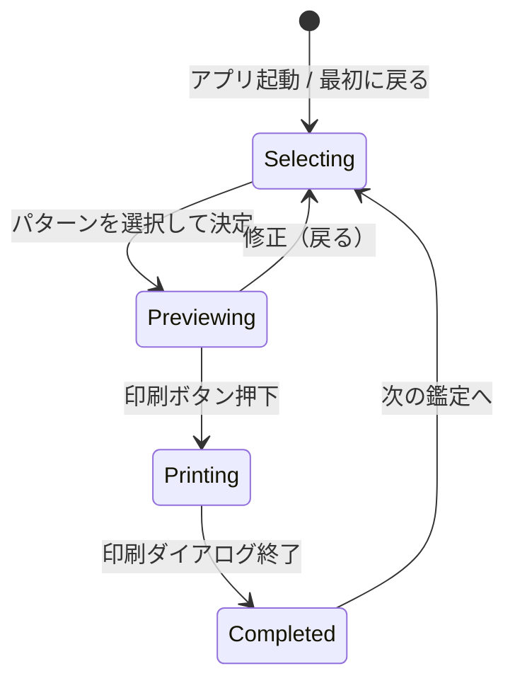
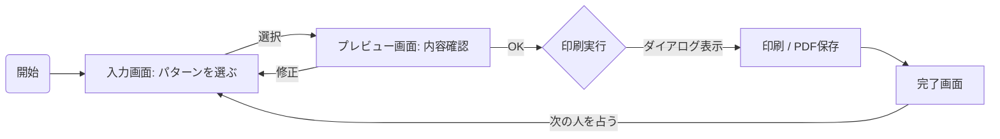

# フェーズ2: モデリング - 構造と振る舞いの定義

## 1. 概念データモデリング (構造の定義)

システムが管理・表示する情報の構造を定義します。
本システムにおける主要なデータは、事前に定義された「パターン」という静的な参照データです。

### クラス図 (概念モデル)

### オブジェクト詳細

#### Pattern (パターン)
12種類の定数データとしてシステムに保持される。
* **ID**: ユーザーが選択するキー (1〜12)。
* **EnergyLowYear**: エネルギーが落ちる年の表記（例：「子、丑、-」）。
* **InteriorAdvice**: 「能力を引き出すインテリア」に関するアドバイス文。
* **TabooColor**: タブー色（薬色）の色名。
* **EnergyUpColors**: 6種類のエネルギーUP色のセット。

#### EnergyUpColors (エネルギーUP色セット)
Patternに紐づく6色の組み合わせ。
* 各属性（自分色、やる気色など）は具体的な色名（例：「ピンク」「ブラウン」）を持つ。
* 色名だけでなく、表示用のカラーコード（HEX/RGB）も表示には必要となる（UIデザインフェーズで具体化）。

## 2. タスク/状態モデリング (振る舞いの定義)

### ステートマシン (状態遷移)

画面遷移を伴うフローに変更します。

* **Selecting (選択状態)**: 一覧から該当するパターンを探している状態。
* **Previewing (確認状態)**: 選択したパターンの鑑定書イメージを確認している状態。
* **Printing (印刷状態)**: ブラウザの印刷機能が動作している状態。
* **Completed (完了状態)**: 印刷指示が終わり、次のアクション（終了または新規作成）を待機している状態。

### タスクフロー

1. **パターン選択**: 占い師は、手元の判定結果（例：「子・丑のマイナス」）と画面上のリストを照合し、該当するパターンを選択する。
2. **プレビュー遷移**: 選択と同時に（あるいは決定ボタンで）プレビュー画面へ遷移する。
3. **確認・印刷**: A4イメージを確認し、問題なければ印刷を実行する。
4. **完了・次へ**: 印刷後、完了画面が表示され、次の依頼者の鑑定に移るための導線が提示される。
